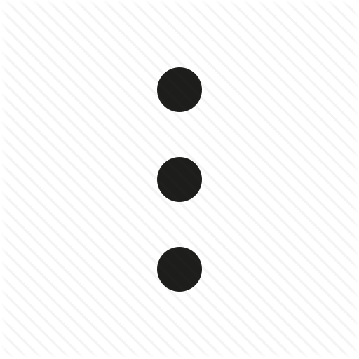

# stanislavm31.github.io
<!DOCTYPE html>
<html>
	<meta http-equiv="Content-Type" content="text/html; charset=UTF-8">
	<link rel="stylesheet" href="page.css">

<head>
	<link rel="icon" href=".images/icon_tlgrm.png" type="">
</head>

	<body>
		

			

				

				

				

			

		

		

			

				

					

						

							
						

						

							

								<input class ="input_1" size="40%" placeholder="  Search">

							

						

					

										
				

				

					<!--ul-->
					

						
							
								
							

								

									

										
									

									
<b>Work group</b>

									
00:37

								

								

									

Andrey A.
:Hi!

									

								

							

						

							

								
								

									

										
<b>Andrey A.</b>

										

											
										

										
00:35

									

									

										
Hello, go to the "Work group"

										

									

								

							

						
							

								
								

									

										
<b>Ivan I.</b>

										

											
										

										
00:35

									

									

										
Hello, go to the "Work group"

										

									

								

							

						
							

								
								

									

										
<b>Boris B.</b>

										

											
										

										
00:35

									

									

										
Hello, go to the "Work group"

										

									

								

							

							

								
								

									

										
<b>Alex</b>

										

											
										

										
00:01

									

									

										
Wasuuup, man!"

										

									

								

							

							

								
								

									

										
<b>Helga Ditz</b>

										

											
										

										
22:10

									

									

										
Hello

										

									

								

							

					

				

			

			

				

					

						
Work group

						
4 members

					

				
					

						

						

						

					

				

			

					

						
							

								

									

										
Andrey A.

										
Hi!

									

									

										
Reply

										

										
00:42

									

								

							

								

									
									
Hi!

								

								

									
Reply

									
00:42

								

							

							

								

									
									
Did u all get my email?

								

								

									
Reply

									
00:42

								

							

						

					

						<!-- 2 message -->
					
 
						

							

								

									
Hi! Yes I get

								

								

									
Reply

									
00:42

								

							

							

								

									
Everything will be done on time

								

								

									
Reply

									
00:43

								

							

						

					

					<!-- 3 message -->
					

						
						

							

								

									
Boris B.

									
Hello

								

								

									
Reply

									

									
00:43

								

							

						

							

								
								
I will do my best

							

							

								
Reply

								
00:44

							

						

					

				

				<!-- 4 message -->
				

					
					

						

							

								
Ivan I.

								
Hello. It's ok

							

							

								
Reply

								

								
00:45

							

						

					

				

				<!-- 5 message -->
				

					
					

						

							

								
Andrey A.

								
let's go on

							

							

								
Reply

								

								
00:47

							

						

					

				

				<!-- 6 message -->
				
 
					

						

							

								
Bye.

							

							

								
Reply

								
00:47

							

						

					

				

				<!-- 7 message -->
				

					
					

						

							

								
Boris B.

								
Bye!

							

							

								
Reply

								

								
00:47

							

						

					

				

				<!-- 8 message -->
				

					
					

						

							

								
Ivan I.

								
See you soon.

							

							

								
Reply

								

								
00:47

							

						

					

				

			

			<!-- magic -->
			
    
				

					
					

 
					
					<input class="input_2" type="text" placeholder="Write a message...">
					

						

						

					

				

				
			

		

		
		

			
Group Info

			

					
						
					
					

						
Work group

						
4 members

					
 
					

				

				

					

						
						

							Notification
						

						<label class="switch">
							<input type="checkbox" checked>
							
						</label>
					

				

				

					
					

						4 MEMBERS
					

					
				

				

					
							
						
					

						

							
<b>Stanislav Minko</b>

						

						

							
Online

						

					

				

					
							
						
					

						

							
<b>Andrey A.</b>

						

						

								
Last seen recently

							

						

					

					
							
						
					

						

							
<b>Boris B.</b>

						

						

							
Last seen 1 hour ago

						

					

				

					
							
						
					

						

							
<b>Ivan I.</b>

						

						

							
Last seen 1 hour ago

						

					

				

			
		

		<!-- /container -->
	</body>
</html>
